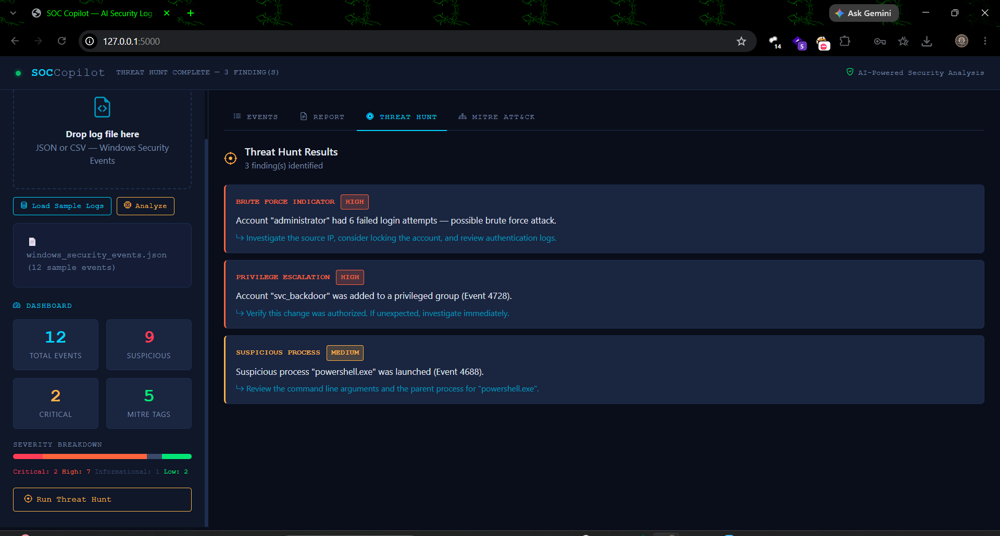
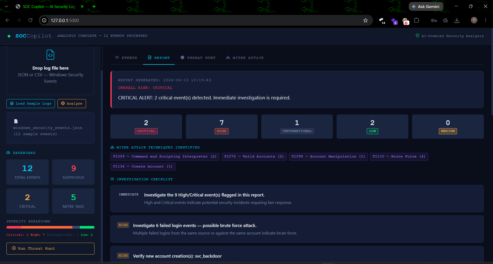

# 🛡️ SOC Copilot — AI-Powered Security Operations Center (SOC) Platform

> **Detect threats. Investigate security events. Map attacker behavior. Generate actionable intelligence. Forward enriched findings to Splunk.**

SOC Copilot is an AI-powered cybersecurity platform that transforms raw Windows Security Event Logs into actionable security intelligence. Built for SOC analysts, cybersecurity learners, and security teams, the platform combines threat detection, MITRE ATT&CK mapping, AI-assisted investigations, automated threat hunting, and Splunk integration within a unified SOC-style dashboard.

Upload Windows Security Event Logs and instantly receive enriched event analysis, severity scoring, attack technique mapping, threat-hunting results, investigation guidance, remediation recommendations, and executive-ready security reports.

---

## 🎯 Why SOC Copilot?

Security analysts often face thousands of security events daily. Understanding whether an event represents normal activity or a potential attack requires significant time and expertise.

SOC Copilot accelerates investigations by automatically:

* 🎯 Prioritizing suspicious events using severity scoring
* 🤖 Explaining security events in plain English
* 🗺️ Mapping attacker behavior to MITRE ATT&CK
* 🔍 Detecting attack patterns across multiple events
* 📄 Generating investigation and remediation guidance
* 🔗 Sending enriched findings to Splunk for monitoring and correlation

---

## 📄 Interactive Dashboard Mockup

Explore the standalone SOC dashboard prototype:

👉 [Open Dashboard Mockup](dashboard/soc_copilot_dashboard.html)

---

## ✨ Features

| Feature                      | Description                                                                                    |
| ---------------------------- | ---------------------------------------------------------------------------------------------- |
| 📤 Windows Log Analysis      | Upload and analyze Windows Security Event Logs (JSON/CSV)                                      |
| 🤖 AI-Assisted Investigation | Generate security explanations, threat assessments, and analyst guidance                       |
| 🎯 Severity Scoring Engine   | Risk-based scoring system with Critical, High, Medium, Low, and Informational classifications  |
| 🗺️ MITRE ATT&CK Mapping     | Automatically map events to ATT&CK techniques, tactics, and adversary behaviors                |
| 🔍 Automated Threat Hunting  | Detect brute force attacks, privilege escalation, suspicious accounts, and malicious processes |
| 📊 SOC Dashboard             | Interactive analyst dashboard with event statistics and severity breakdowns                    |
| 📄 Investigation Reports     | Generate investigation checklists and remediation recommendations                              |
| 🔗 Splunk HEC Integration    | Forward enriched security events and threat-hunt findings directly to Splunk                   |
| 🛡️ Event Enrichment         | Combine severity, MITRE context, AI analysis, and threat intelligence into a unified view      |
| 🖥️ SOC-Inspired Interface   | Modern dark-themed cybersecurity dashboard designed for analysts                               |
| 📱 Responsive Design         | Optimized for desktop and mobile devices                                                       |

---

## 🚀 Core Capabilities

### Security Event Analysis

Transform raw Windows Security Events into human-readable security insights.

### Threat Hunting

Identify indicators of compromise including:

* Brute Force Attacks
* Privilege Escalation
* Suspicious PowerShell Activity
* Unauthorized Account Creation
* Privileged Group Modifications

### MITRE ATT&CK Intelligence

Understand attacker behavior through technique and tactic mapping aligned with the MITRE ATT&CK framework.

### Splunk Integration

Forward enriched events, threat-hunting findings, severity scores, and investigation results to Splunk through HTTP Event Collector (HEC) for centralized monitoring and analysis.

### AI-Powered Investigations

Leverage AI-assisted reasoning to generate:

* Event Summaries
* Threat Assessments
* Investigation Steps
* Analyst Recommendations
* Remediation Actions

---

## 🏆 Sample Attack Scenario

SOC Copilot can detect and investigate a complete attack chain:

1. Brute Force Login Attempts (Event ID 4625)
2. Successful Account Compromise (Event ID 4624)
3. PowerShell Command Execution (Event ID 4688)
4. Unauthorized Account Creation (Event ID 4720)
5. Privilege Escalation via Group Membership Changes (Event ID 4728)

The platform correlates these events, maps them to MITRE ATT&CK techniques, generates investigation guidance, and produces a comprehensive security report.


### Supported Windows Event IDs
| Event ID | Description | MITRE Technique |
|---|---|---|
| 4624 | Successful Logon | T1078 — Valid Accounts |
| 4625 | Failed Logon | T1110 — Brute Force |
| 4688 | Process Created | T1059 — Command & Scripting Interpreter |
| 4720 | User Account Created | T1136 — Create Account |
| 4728 | Member Added to Privileged Group | T1098 — Account Manipulation |

---

## 🚀 Installation & Running (Windows 11)

### Prerequisites
- Python 3.10 or higher installed
- Internet connection (optional, for AI-assisted analysis)
- Git (optional, for cloning the repository)

### Step 1 — Clone or Download
```
Clone or download the repository and extract it to a folder of your choice.

git clone https://github.com/YOUR_USERNAME/soc-copilot.git
cd soc-copilot

Or download the ZIP file and extract it.
```

### Step 2 — Open Terminal
```
Press Win + R, type cmd, press Enter.
cd path\to\splunk-soc-copilot
```
Or right-click the folder in Explorer → "Open in Terminal"

### Step 3 — Create a Virtual Environment
```bash
python -m venv venv

Activate it:

Command Prompt (CMD)

venv\Scripts\activate.bat

PowerShell

.\venv\Scripts\Activate.ps1
```
You should see `(venv)` appear in your terminal prompt.

### Step 4 — Install Dependencies
```bash
pip install -r requirements.txt
```
### Step 5 — Run SOC Copilot
Option A: One-Click Launcher (Recommended)

Double-click:

start_soc_copilot.bat

Option B: Run from Terminal
python app.py

---
### Step 6 — Open in Browser
Navigate to: **http://127.0.0.1:5000**

Click **"Try Sample Logs"** to immediately see a full demo with a simulated attack scenario.

---
🤖 Optional AI-Assisted Analysis

To enable AI-assisted analysis, configure your API key before starting the application.

Command Prompt

set ANTHROPIC_API_KEY=your-api-key

PowerShell

$env:ANTHROPIC_API_KEY="your-api-key"

If no API key is configured, SOC Copilot will continue to operate using offline rule-based analysis.

## 📁 Project Structure

```
soc-copilot/
│
├── app.py                  ← Flask web server, API endpoints
├── analyzer.py             ← AI reasoning engine 
├── mitre_mapping.py        ← MITRE ATT&CK technique lookup table
├── severity_engine.py      ← Severity scoring (0–100) with context analysis
├── report_generator.py     ← Security report and checklist generator
│
├── requirements.txt        ← Python dependencies
├── README.md               ← This file
│
├── templates/
│   └── index.html          ← Single-page web interface (Bootstrap 5)
│
├── static/                 ← Static assets (CSS/JS if needed)
│
├── sample_logs/
│   └── windows_security_events.json  ← 12 sample events with a simulated attack chain

```

---

## 🧠 How SOC Copilot Works

SOC Copilot transforms raw Windows Security Event Logs into actionable security intelligence through a multi-stage analysis pipeline.

```text
Windows Security Events
          │
          ▼
    Event Parsing
          │
          ▼
   Severity Scoring
          │
          ▼
 MITRE ATT&CK Mapping
          │
          ▼
 AI-Assisted Investigation
          │
          ▼
     Threat Hunting
          │
          ▼
   Security Reporting
          │
          ▼
  Splunk Integration
```

### 1️⃣ Event Parsing

SOC Copilot extracts key security information from uploaded logs, including:

* Event ID
* Username
* Source IP Address
* Timestamp
* Process Name
* Computer Name

### 2️⃣ Severity Scoring Engine

Each event is assigned a risk score between **0–100** based on event type and contextual indicators.

Examples:

| Event                                     | Risk Level  |
| ----------------------------------------- | ----------- |
| Successful Login (4624)                   | Low         |
| Failed Login (4625)                       | Medium–High |
| New User Account Created (4720)           | High        |
| Privileged Group Membership Change (4728) | Critical    |

### 3️⃣ MITRE ATT&CK Mapping

SOC Copilot maps Windows Security Events to MITRE ATT&CK techniques and tactics to provide adversary context.

Examples:

| Event ID | Technique                               |
| -------- | --------------------------------------- |
| 4625     | T1110 – Brute Force                     |
| 4624     | T1078 – Valid Accounts                  |
| 4688     | T1059 – Command & Scripting Interpreter |
| 4720     | T1136 – Create Account                  |
| 4728     | T1098 – Account Manipulation            |

### 4️⃣ AI-Assisted Investigation

The analysis engine combines:

* Event Details
* Severity Score
* MITRE ATT&CK Context
* Threat Indicators

to generate:

* Security Event Summary
* Threat Assessment
* Investigation Steps
* Remediation Recommendations
* Analyst Guidance

### 5️⃣ Threat Hunting Engine

SOC Copilot analyzes events collectively to identify attack patterns and indicators of compromise.

Current detections include:

* Brute Force Activity
* Privilege Escalation Attempts
* Suspicious PowerShell Execution
* Unauthorized Account Creation
* Privileged Group Modifications

### 6️⃣ Security Reporting

The platform generates investigation-ready reports containing:

* Severity Overview
* MITRE ATT&CK Coverage
* Threat Hunting Findings
* Investigation Checklist
* Recommended Actions

### 7️⃣ Splunk Integration

Enriched security events, threat assessments, MITRE ATT&CK mappings, and threat-hunting findings are forwarded to Splunk using the HTTP Event Collector (HEC), enabling centralized monitoring, searching, and visualization within a SIEM environment.


---

## 🔒 Sample Attack Scenario

The included sample logs (`windows_security_events.json`) simulate a **realistic attack chain**:

1. **Brute Force** — 6 failed logins against the Administrator account
2. **Successful Access** — Attacker authenticates from IP 192.168.1.45
3. **Malicious PowerShell** — Encoded PowerShell command executes a download cradle
4. **Backdoor Account** — New account `svc_backdoor` created
5. **Privilege Escalation** — `svc_backdoor` added to Domain Admins group
6. **Normal Activity** — Legitimate user `jsmith` logging in (baseline)

This mirrors real-world attack patterns mapped to the MITRE ATT&CK framework.

---

## 🖼️ Screenshots

> 

## 🖼️ Screenshots


| Screen | Preview | Description |
|---|---|---|
| Welcome Screen |  | Dark terminal-themed landing with ASCII art |
| Event Analysis |  | Per-event AI analysis with severity badges |
| Threat Hunt |  | Automated pattern detection results |
| Report View |  | Investigation checklist and remediation guide |
| MITRE ATT&CK |  | Technique cards with links to official MITRE site |

---

## 🚀 Future Roadmap

The following enhancements are planned to further expand SOC Copilot's threat detection, investigation, and SOC automation capabilities:

* [ ] **Advanced Splunk Dashboards** — Interactive security dashboards, visualizations, and alerting for enriched SOC Copilot events
* [ ] **Microsoft Sentinel Integration** — Forward enriched findings to Microsoft Sentinel for cloud-native SOC operations
* [ ] **Elastic Security Integration** — Support Elastic Stack for centralized security monitoring
* [ ] **Sigma Rule Engine** — Parse and apply community-driven Sigma detection rules
* [ ] **Attack Timeline View** — Visualize attacker activity and event progression chronologically
* [ ] **Multi-Source Correlation** — Correlate Windows logs, Sysmon events, firewall logs, and authentication logs
* [ ] **PDF & Executive Reports** — Export investigation reports and incident summaries
* [ ] **Custom Detection Rules** — Allow analysts to create and manage custom detection logic
* [ ] **User Authentication & Case Management** — Save investigations, track incidents, and manage analyst workflows
* [ ] **Sysmon Support** — Advanced endpoint visibility using Sysmon Event IDs and telemetry
* [ ] **Network Security Analysis** — Support firewall, proxy, DNS, and network traffic logs
* [ ] **Threat Intelligence Integration** — Enrich events with external IOC and threat intelligence feeds
* [ ] **SOAR Automation** — Automated response actions such as IP blocking, account disabling, and alert escalation
* [ ] **AI Incident Summarization** — Generate executive-ready incident summaries and response recommendations

---

## 📜 License

This project is intended for educational, research, and demonstration purposes. It showcases cybersecurity concepts including Windows Security Event Log analysis, threat hunting, MITRE ATT&CK mapping, AI-assisted investigations, security event enrichment, and Splunk integration.

Users are responsible for ensuring compliance with applicable security policies, organizational requirements, and third-party service terms when deploying or modifying this project.

---

### 🛠️ Built With

* Python
* Flask
* Bootstrap 5
* Claude AI (Optional)
* Splunk HTTP Event Collector (HEC)
* MITRE ATT&CK Framework

### 🔐 Core Capabilities

* Windows Security Event Log Analysis
* Threat Hunting & Attack Pattern Detection
* MITRE ATT&CK Technique Mapping
* AI-Assisted Security Investigations
* Severity Scoring & Event Enrichment
* Security Reporting & Remediation Guidance
* Splunk Integration for Centralized Monitoring

---

**SOC Copilot demonstrates how AI, threat detection, event enrichment, and SIEM integration can help security analysts investigate threats more efficiently.**

